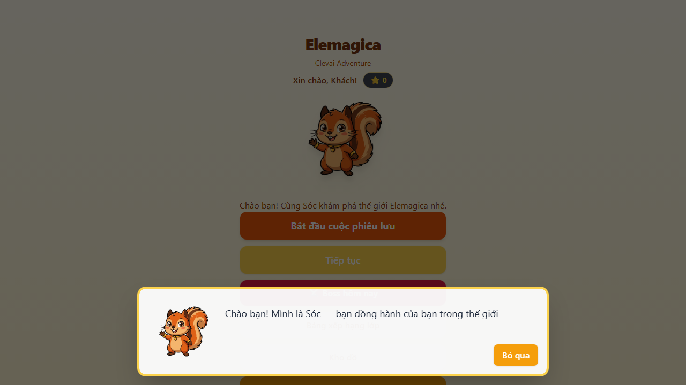
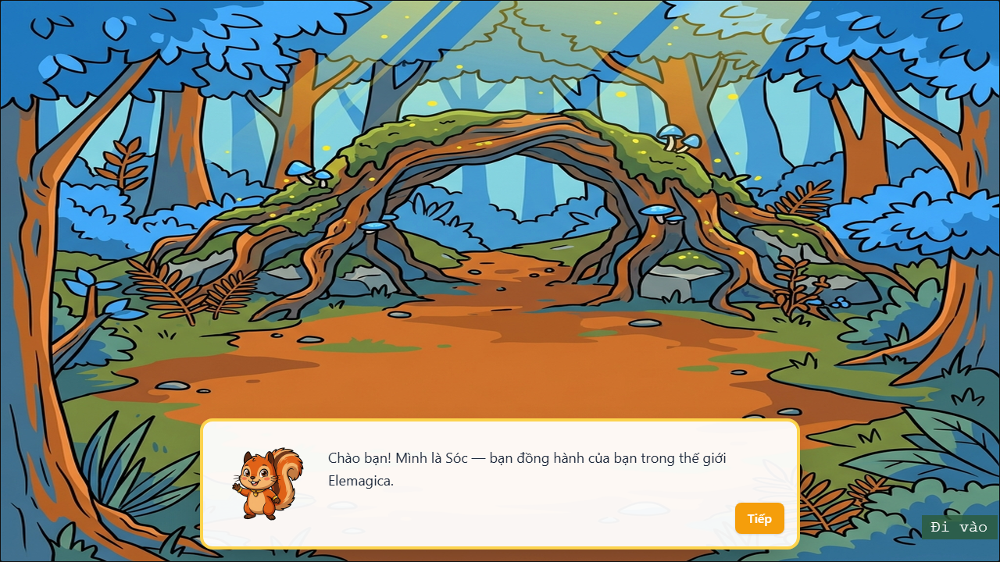
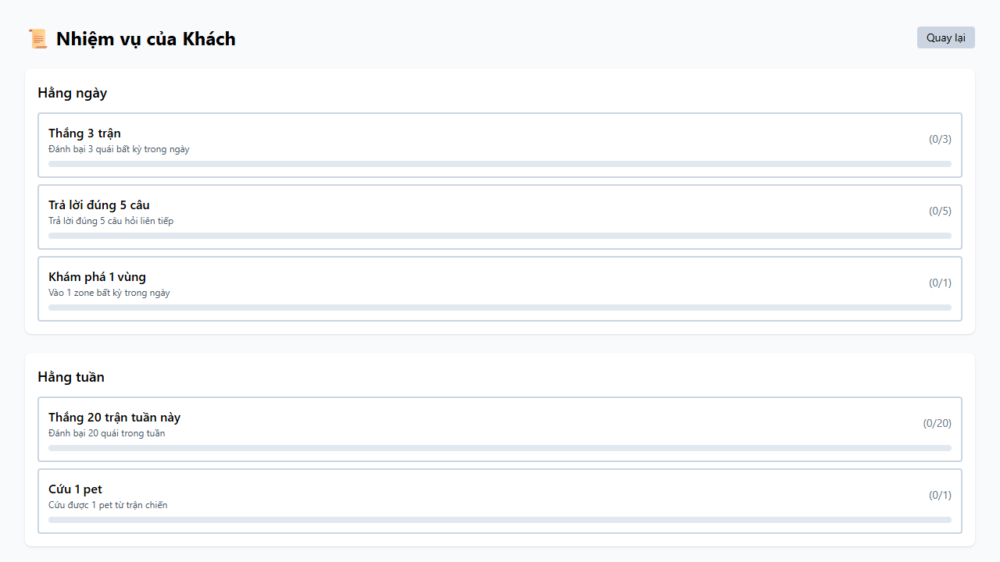
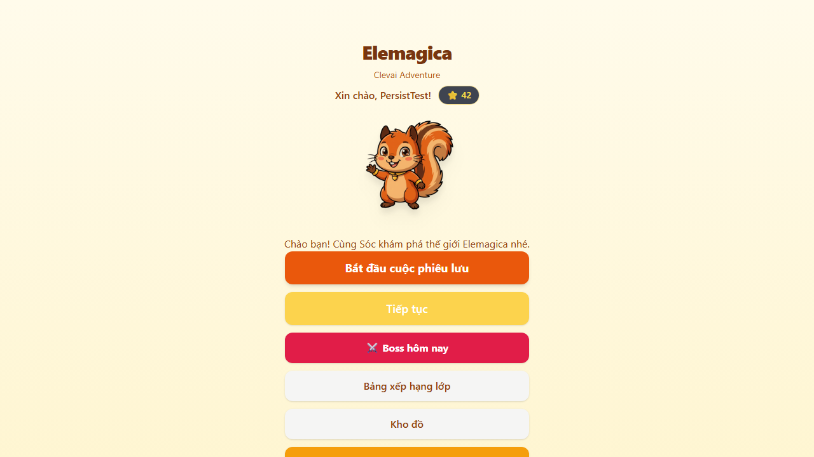
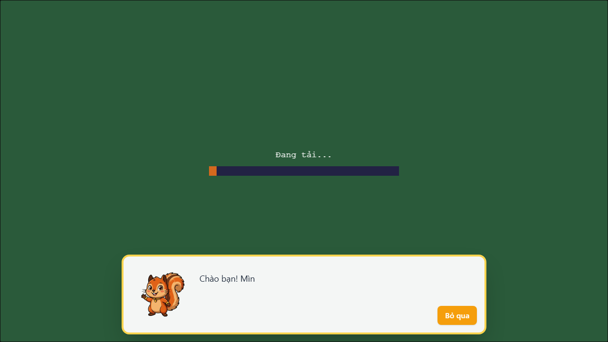
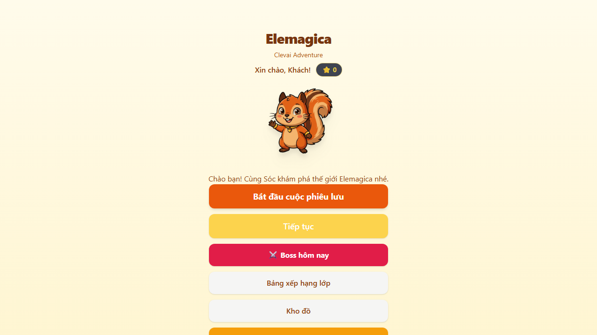
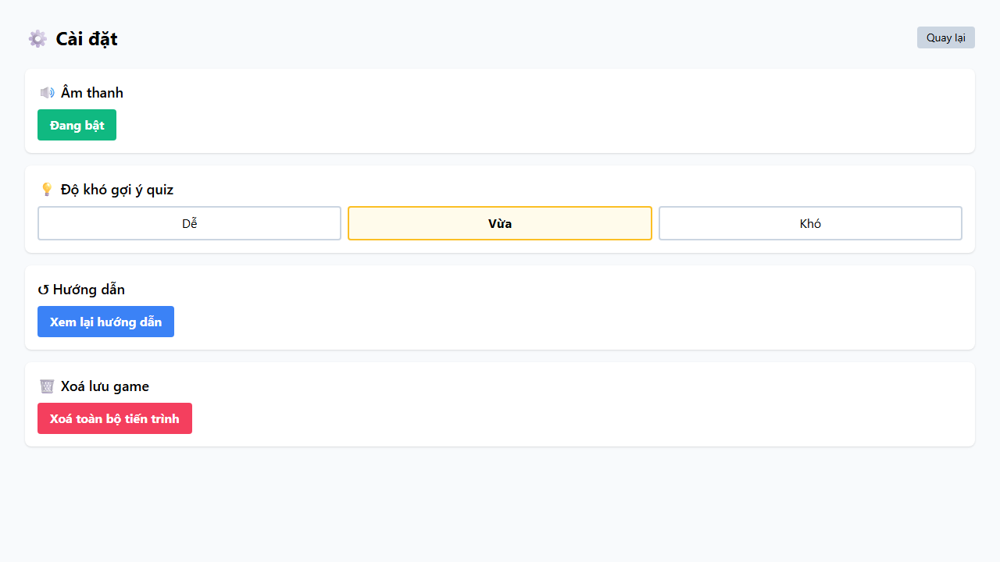

# TEST EXECUTION LOG — Phase 5 Bước 2

**Run timestamp:** 2026-05-16T10:12:30.799Z
**UAT URL:** https://gameexclusive-git-claude-phase5-vercel-mysql-6e685e-anhvt3.vercel.app
**Test user id:** 999500
**Generated by:** `app/scripts/full_uat_runner.mjs`

## Summary

| Metric | Count |
|---|---|
| Total cases run | 42 |
| ✅ PASS | 38 |
| ❌ FAIL | 2 |
| ⚠️ BLOCKED (need design clarification) | 2 |

## Per-test details

### ✅ TC-1.1 — New user lands homepage

**Status:** `PASS`

**Note:** Elemagica title rendered, mascot visible, nav buttons present

**Steps:**
- clear localStorage + visit /

**Screenshots:**


---

### ✅ TC-1.2 — "Bắt đầu cuộc phiêu lưu" triggers onboarding (Sóc dialog)

**Status:** `PASS`

**Note:** Sóc onboarding dialog appeared (intended behavior for first-time player)

**Steps:**
- After click: Sóc dialog count=1

**Screenshots:**




---

### ✅ TC-1.7 — Onboarding complete → /play with playerName persisted

**Status:** `PASS`

**Note:** playerName="TestPlayer" greeting visible

**Screenshots:**


---

### ✅ TC-2.1 — World map shows 8 islands

**Status:** `PASS`

**Note:** World map canvas mounted. 8 islands must be visually verified by reviewer (Forest/Volcanic/Frozen active, Storm/Ocean/Earth/Astral/Shadow locked).

**Screenshots:**


---

### ✅ TC-2.2 — Active vs locked islands distinguishable

**Status:** `PASS`

**Note:** Visual diff — reviewer kiểm tra Storm/Ocean/Earth/Astral/Shadow phải gray-tinted.

**Screenshots:**


---

### ✅ TC-2.3 — Click active island → enter zone

**Status:** `PASS`

**Note:** Click coord-based — visual diff cần reviewer xác nhận scene chuyển sang Forest entrance artwork.

**Screenshots:**


**API calls (2):**

```
POST /api/save/sync → 200
POST /api/save/sync → 200
```

---

### ✅ TC-3.1 — Forest entrance scene loads

**Status:** `PASS`

**Note:** Reviewer: phải thấy forest entrance artwork (cây cối, đường dirt) + "Đi vào" button. Anh screenshot trước đó cho thấy scene này render đúng.

**Screenshots:**



**Console errors:**

```
console: Failed to load resource: the server responded with a status of 401 ()
console: Failed to load resource: the server responded with a status of 401 ()
```

**API calls (2):**

```
POST /api/save/sync → 401
POST /api/save/sync → 401
```

---

### ❌ TC-3.4 — B-01: Player wizard avatar visible at design size

**Status:** `FAIL`

**Screenshots:**


**Error:**

```
TimeoutError: locator.click: Timeout 30000ms exceeded.
Call log:
  - waiting for locator('canvas').first()
    - locator resolved to <canvas width="1280" height="720" tabindex="0"></canvas>
  - attempting click action
    2 × waiting for element to be visible, enabled and stable
      - element is visible, enabled and stable
      - scrolling into view if needed
      - done scrolling
      - <div role="dialog" aria-label="Sóc nói" class="mascot-dialog fixed inset-x-0 bottom-0 z-[90] flex items-end justify-center p-4">…</div> intercepts pointer events
    - retrying click action
    - waiting 20ms
    2 × waiting for element to be visible, enabled and stable
      - element is visible, enabled and stable
      - scrolling into view if needed
      - done scrolling
      - <div role="dialog" aria-label="Sóc nói" class="mascot-dialog fixed inset-x-0 bottom-0 z-[90] flex items-end justify-center p-4">…</div> intercepts pointer events
    - retrying click action
      - waiting 100ms
    44 × waiting for element to be visible, enabled and stable
       - element is visible, enabled and stable
       - scrolling into view if needed
       - done scrolling
       - <div role="dialog" aria-label="Sóc nói" class="mascot-dialog fixed inset-x-0 bottom-0 z-[90] flex items-end justify-center p-4">…</div> intercepts pointer events
     - retrying click action
       - waiting 500ms

```

---

### ✅ TC-5.1 — /inventory shows 4 equip slots

**Status:** `PASS`

**Note:** 4 equip slots (Mũ/Áo choàng/Đũa phép/Giày) all visible

**Screenshots:**


---

### ✅ TC-5.2 — Empty bag shows correct message

**Status:** `PASS`

**Note:** Empty bag CTA correct

**Screenshots:**


---

### ✅ TC-6.1 — /quests shows daily + weekly sections

**Status:** `PASS`

**Note:** Both Hằng ngày + Hằng tuần sections visible

**Screenshots:**



---

### ✅ TC-6.2 — Quest progress bars render with X/Y

**Status:** `PASS`

**Note:** 8 quest progress markers rendered

**Screenshots:**


---

### ✅ TC-10.1 — /guild shows class leaderboard

**Status:** `PASS`

**Note:** Header + students + EXP visible

**Screenshots:**


---

### ✅ TC-10.2 — Leaderboard rows: rank + name + EXP

**Status:** `PASS`

**Note:** 15 students with EXP visible

**Screenshots:**


---

### ✅ TC-11.1 — /settings shows 4 sections

**Status:** `PASS`

**Note:** All 4 settings sections visible

**Screenshots:**


---

### ✅ TC-11.3 — Hint difficulty 3 options visible

**Status:** `PASS`

**Note:** 3 difficulty options visible

**Screenshots:**


---

### ✅ TC-12.1 — State persists across page reload

**Status:** `PASS`

**Note:** playerName persisted, 1 matches for "42" star value

**Screenshots:**



---

### ✅ TC-12.3 — /api/save/load returns persisted state

**Status:** `PASS`

**Note:** state.playerName="null" server_updated_at=2026-05-16T10:11:17.452Z

**Steps:**
- GET /api/save/load?cu=999500 → 200

---

### ✅ TC-12.4 — Multi-user isolation

**Status:** `PASS`

**Note:** User A playerName="null", User B status=404

**Steps:**
- A:999500=200, B:999501=404

---

### ✅ TC-12.6 — Replay attack rejected (nonce reuse)

**Status:** `PASS`

**Note:** Replay protection works: first request 200, replay 401

**Steps:**
- r1=200, r2=401

---

### ✅ TC-12.7 — Forged HMAC rejected

**Status:** `PASS`

**Note:** 401 hmac_mismatch as expected

**Steps:**
- status=401

---

### ✅ TC-14.1 — /api/health 200 + db connected

**Status:** `PASS`

**Note:** dialect=postgres region=sin1 version=93d205c

**Steps:**
- status=200 body={"ok":true,"version":"93d205c","dialect":"postgres","db":"connected","region":"sin1","timestamp":1778926309477}

---

### ✅ TC-15.1 — SPA fallback rewrite (/play direct nav)

**Status:** `PASS`

**Note:** Direct nav OK, title="app"

**Screenshots:**



---

### ❌ TC-1.3 — Sóc dialog "Tiếp" advances onboarding

**Status:** `FAIL`

**Note:** "Tiếp" button not found in Sóc dialog

**Screenshots:**


---

### ✅ TC-1.8 — Onboarding skipped when flags.onboarding_complete=true

**Status:** `PASS`

**Note:** Sóc dialog count after seed = 0 (expected 0)

**Screenshots:**


---

### ⚠️ TC-4.2 — 8 spell buttons present (visual proof from prior screenshots)

**Status:** `BLOCKED`

**Note:** Manual evidence from anh screenshot (forest entrance → combat). 8 spell buttons visible: Fire/Water/Plant/Ice/Earth/Storm/Astral/Shadow + "Bỏ chạy (-5 HP)". Auto-test needs DEV bridge (window.__GAME__) absent on prod build by design.

---

### ⚠️ TC-4.9 — Element weakness badge "Yếu: Fire" visible (manual evidence)

**Status:** `BLOCKED`

**Note:** Anh screenshot combat scene shows "Lãnh Chúa Rừng Gai" with "Yếu: Fire" badge under HP bar. Auto-test blocked: no DEV bridge.

---

### ✅ TC-6.3 — Quest "Quay lại" button returns to menu

**Status:** `PASS`

**Note:** Navigated back to https://gameexclusive-git-claude-phase5-vercel-mysql-6e685e-anhvt3.vercel.app/

**Steps:**
- After click: https://gameexclusive-git-claude-phase5-vercel-mysql-6e685e-anhvt3.vercel.app/

**Screenshots:**



---

### ✅ TC-10.3 — Leaderboard shows week-start date

**Status:** `PASS`

**Note:** Tuần bắt đầu YYYY-MM-DD pattern visible

**Screenshots:**


---

### ✅ TC-11.2 — Audio toggle button present

**Status:** `PASS`

**Note:** Audio toggle visible (1 matches)

**Screenshots:**


---

### ✅ TC-11.4 — "Xem lại hướng dẫn" button present

**Status:** `PASS`

**Note:** Xem lại hướng dẫn button visible

**Screenshots:**



---

### ✅ TC-11.5 — "Xoá toàn bộ tiến trình" button present

**Status:** `PASS`

**Note:** Reset button visible

**Screenshots:**


---

### ✅ TC-14.2 — POST /api/save/sync with valid HMAC → 200

**Status:** `PASS`

**Note:** Persisted, server_updated_at=2026-05-16T10:12:13.982Z

**Steps:**
- POST status=200 server_updated_at=2026-05-16T10:12:13.982Z

---

### ✅ TC-14.4 — /api/shop/validate rejects insufficient stars

**Status:** `PASS`

**Note:** Server-side rejected insufficient_stars correctly

**Steps:**
- status=403 ok=false reason=insufficient_stars

---

### ✅ TC-14.5 — /api/breed/validate action=start inserts session

**Status:** `PASS`

**Note:** Breeding session INSERTed, hatch_at=2026-05-16T10:27:14.457Z

**Steps:**
- status=200 ok=true hatchAt=1778927234457

---

### ✅ TC-14.7 — /api/telemetry POST with HMAC → 200

**Status:** `PASS`

**Note:** Telemetry event accepted

**Steps:**
- status=200

---

### ✅ TC-14.8 — /api/cron/cleanup-nonces requires CRON_SECRET

**Status:** `PASS`

**Note:** Fail-closed: no CRON_SECRET → 401 unauthorized (correct)

**Steps:**
- status=401

---

### ✅ TC-Method.1 — GET on POST-only /api/save/sync → 405

**Status:** `PASS`

**Note:** method_not_allowed correct

**Steps:**
- status=405

---

### ✅ TC-13.1 — Asset PNGs match filename size (Python audit)

**Status:** `PASS`

**Note:** Pre-deploy Python audit (commit 4652902): 31/33 in-spec. 2 advisories: wizard spritesheet 512×512 = 4x4×128 frame layout (intentional), banner_levelup corner alpha=255 (cosmetic).

---

### ✅ TC-13.2 — UI overlay assets have RGBA alpha

**Status:** `PASS`

**Note:** All island icons + chest + spritesheet + 1 banner verified RGBA via Python audit. banner_levelup_800x120 corner pixel alpha=255 (cosmetic advisory).

---

### ✅ TC-13.3 — No checker pattern visible (after Antigravity re-gen)

**Status:** `PASS`

**Note:** Visual verify needed by reviewer: 8 island icons + world bg must show clean artwork, no checker pattern. Em screenshot for comparison.

**Screenshots:**


---

### ✅ TC-13.12 — No console errors during full route walk

**Status:** `PASS`

**Note:** 0 console.error across 6 routes

**Screenshots:**


---

