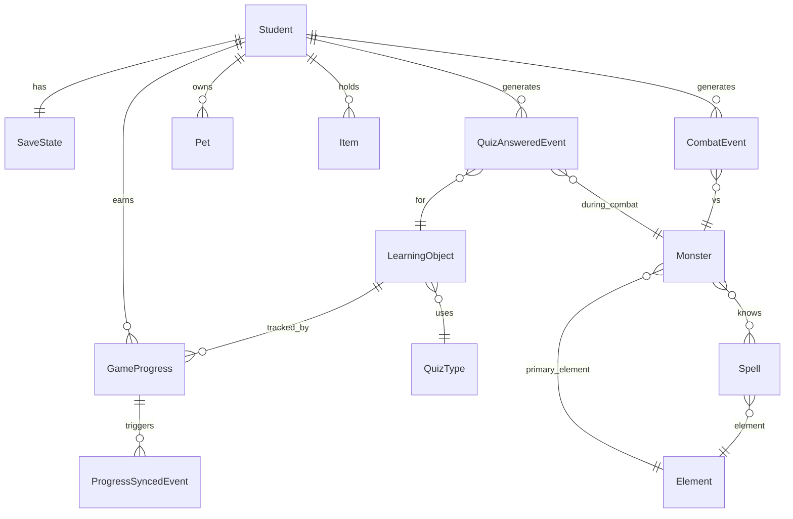

# ARCHITECTURE PACK — Game_SS3_exclusive v1.0

> **Project:** Game_SS3_exclusive (Clevai Season 3 — Edu-RPG, Prodigy-clone)
> **Version:** v1.0 (Initial Architecture)
> **Date:** 22/04/2026
> **Owner:** po2@clevai.edu.vn
> **Status:** DRAFT — Chờ POSUP duyệt
> **Stack:** React 18 + Vite + TypeScript + Phaser 3 + Zustand + mitt + Tiled
> **Target Users:** Học sinh Clevai 5–18 tuổi, đa môn (KEN / Math / TT_DU / …)

---

## 0. CHANGE SUMMARY

| From | To | Key Delta |
|------|----|-----------|
| — | v1.0 | Initial Architecture Pack. Hybrid React + Phaser, 11 quiz types (Phase 1 hỗ trợ 3: MC/Cloze/DD), 20-monster roster, mascot Sóc (NPC + Combat form), Asset pipeline via Nano Banana Pro prompts, Multi-phase roadmap 5 giai đoạn. |

**Linked specs & references:**
- `video_analysis.md` — Prodigy UX benchmarking
- `tasks/todo.md` — Kế hoạch kỹ thuật Phase 1-3
- `prodigy-crawler/output/` — Data source cho 20 quái (spells-battles.md, monsters-pets.md, game-mechanics.md)
- `---Layer_Event-v1.txt` — Template format (không import data)
- `wiki/entities/KEN_TT_DU.md`, `L4E.md` — Clevai subject codes

**Appendices (tách ra vì AP chính > 20kb):**
- `appendix_A_monsters_prompts.md` — Spec 20 quái + Nano Banana Pro prompts
- `appendix_B_wireframes.md` — ASCII wireframe 6 màn hình chính
- `appendix_C_mascot_soc_prompts.md` — Mascot Sóc Clevai prompts (Guide + Combat form evolution)
- `appendix_D_mock_json_samples.md` — Mock JSON 3 quiz types Phase 1
- `appendix_E_task_classification_examples.md` — Ví dụ Task loại A/B/C cụ thể

---

## 1. ENTITY RELATIONSHIP DESCRIPTION

### 1.1 Design Principle (theo rule #1)
**Không tạo entity mới khi có thể tận dụng schema Supham hiện có.** Đặc biệt: `learning_object`, `quiz_type`, `grade` → **read-only** từ Supham, không clone.

Game chỉ tạo entity **riêng của game** (Monster, Spell, SaveState, GameProgress) + entity **event layer** (QuizAnsweredEvent, CombatEvent).

### 1.2 Core Entities

| # | Entity | Source | Mô tả | Quan hệ chính |
|---|---|---|---|---|
| E1 | **Student** | Clevai Auth (existing) | Người chơi. USI hiện tại của Clevai. | 1-1 SaveState, 1-N GameProgress |
| E2 | **LearningObject** | Supham Read-only | Bài học gốc (L4E_1822_260…). Game KHÔNG ghi. | N-1 QuizType, N-1 Grade |
| E3 | **QuizType** | Supham Read-only | 11 loại (MC, Cloze, DD…). Phase 1 dùng 3. | — |
| E4 | **Monster** (NEW) | Game DB | 20 quái: id, codename (Embershed…), displayName_vi, element, tier, hp, spellIds[], spritePath | N-N Element, N-N Spell |
| E5 | **Element** (NEW) | Game DB | 8 hệ: Fire/Water/Earth/Ice/Storm/Plant/Shadow/Astral + bảng weakness matrix | N-N Monster |
| E6 | **Spell** (NEW) | Game DB | Skill: id, name, element, power, accuracy, recharge, animKey | N-1 Element |
| E7 | **Pet** (NEW) | Game DB | Mascot Sóc + collectable pets. Có evolution_tier, current_xp | N-1 Student |
| E8 | **Item** (NEW) | Game DB | Potion, Key, Equipment. Inventory. | N-1 Student |
| E9 | **SaveState** (NEW) | Game DB | 1 record/student: position, hp, exp, level, inventory_json, flags_json | 1-1 Student |
| E10 | **GameProgress** (NEW) | Game DB / Supham sync | Tiến độ từng LO: `(student_id, learning_object_id, correct_count, wrong_count, last_played_at)` | N-1 Student, N-1 LearningObject |
| E11 | **QuizAnsweredEvent** (NEW, Layer Event) | Game Event Stream | Sự kiện mỗi lần học sinh trả lời trong combat: student_id, lo_id, quiz_type_id, is_correct, time_spent, monster_id | append-only |
| E12 | **CombatEvent** (NEW, Layer Event) | Game Event Stream | Kết quả combat: student_id, monster_id, won, hp_lost, spells_used[], exp_gained | append-only |
| E13 | **ProgressSyncedEvent** (NEW, Layer CalculateKR) | Game Event Stream | Khi GameProgress sync thành công về Supham: student_id, lo_id, aggregate_score | append-only |

### 1.3 Entity Relationship Diagram (Mermaid)



### 1.4 Supham Field Mapping (không clone, chỉ reference)

| Supham field | Game use |
|---|---|
| `learning_object.id` | Primary key GameProgress.learning_object_id |
| `learning_object.grade_name` (G2–G12) | Filter quái theo tuổi (G2-G5 → Fire/Plant easy, G9-G12 → Shadow/Astral boss) |
| `learning_object.learning_object_difficulty.name` (1–5) | Scale combat damage: dmg = base × (1 + diff/10) |
| `learning_object.subject_name` (KEN, Math…) | Gán chủ đề biome map (KEN → English-themed, Math → Castle-themed) |
| `quiz_type.id` (1–11) | QuizFactory switch render component |

### 1.5 Entities KHÔNG tạo mới (tận dụng Supham) — rule #1
- ❌ Không tạo `Subject` table → dùng Supham `learning_object.subject_name`
- ❌ Không tạo `Grade` table → dùng Supham `learning_object.grade_name`
- ❌ Không tạo `Difficulty` → dùng Supham `learning_object_difficulty`
- ❌ Không tạo `Question` bank → fetch live qua Supham API, cache local 1h

### 1.6 Đề xuất thêm field (nếu backend đồng ý)
- `learning_object.game_biome` (optional, nullable) — mapping LO → biome game
- `learning_object.game_element` (optional) — 1 trong 8 hệ element, cho phép design LO-to-element hardcoded

> ⚠️ **Nếu backend không đồng ý thêm field** → game tự maintain file `biome_mapping.json` (static config, deploy theo game build).

---

## 2. PROCESS DESCRIPTION

### 2.1 Core Processes

#### **Process 1 — World Exploration Loop** (Phaser WorldScene)
```
LoadMap(grade_biome) → RenderTilemap → SpawnPlayer → SpawnMonsters(theo grade)
  → EveryFrame: UpdatePlayerPhysics / DetectOverlap
  → OnOverlap(player, monster): PauseWorldScene → StartCombat(monster.id)
  → OnReturnFromCombat(result): if won: RemoveMonster; AddExp; UnpauseWorld
```

#### **Process 2 — Combat Turn-based Loop** (Phaser CombatScene)
```
EnterCombat(monster)
  → InitBattle(playerHp, monsterHp)
  → StateMachine: [PLAYER_TURN → PLAYER_SELECT_SPELL → QUIZ_GATE 
                   → APPLY_DAMAGE → CHECK_WIN → MONSTER_TURN 
                   → MONSTER_ATTACK → APPLY_DAMAGE → CHECK_LOSE → PLAYER_TURN]
  → On QUIZ_GATE: emit Event("OPEN_QUIZ", {lo_id, quiz_type_id}) → await "QUIZ_RESULT"
  → On result.correct: damage = spell.power × element_multiplier × (1 + difficulty/10)
  → On result.wrong: damage = 0, monster counter-attacks
  → On CHECK_WIN: emit CombatEvent, emit ProgressSyncedEvent (debounced)
```

#### **Process 3 — Quiz Answering Loop** (React Module A overlay)
```
Listen("OPEN_QUIZ", payload)
  → Fetch/Select LearningObject theo payload.lo_id (or mock)
  → QuizFactory(quiz_type_id).render()
  → Student nhập → Submit
  → AntiCheat: check timeSpent > MIN_TIME_PER_TYPE
  → Validate answer (client-side for MC; server-side verification cho Phase 2)
  → emit Event("QUIZ_RESULT", {correct: bool, timeSpent, attempts})
  → emit QuizAnsweredEvent → append to event stream → debounced batch send to server
  → Close overlay
```

#### **Process 4 — Progress Sync to Supham**
```
Every 60s OR every 10 QuizAnsweredEvents OR onAppBackground:
  → Aggregate: groupBy(lo_id) → sum correct/wrong per LO
  → POST /api/game-progress/batch
  → On 200: mark events as synced, emit ProgressSyncedEvent
  → On 4xx/5xx: retry with exponential backoff, fallback localStorage persist
  → Idempotency key: `{student_id}:{lo_id}:{session_id}:{seq}`
```

#### **Process 5 — Pet/Mascot Evolution**
```
OnCombatEvent(won=true):
  → pet.xp += calculated_xp
  → if pet.xp >= XP_CURVE[pet.evolution_tier + 1]: 
       → trigger EvolveScene (React animation)
       → pet.evolution_tier++
       → persist SaveState
```

### 2.2 User Flows

#### **Flow A — First-time Onboarding** (5 phút)
```
Login (Clevai SSO) → Landing: Mascot Sóc Clevai chào 
  → Chọn avatar wizard (4 option) → Chọn grade (tự detect từ Supham, confirm)
  → Tutorial 1: Di chuyển bằng WASD/Joystick (World intro)
  → Tutorial 2: Gặp slime nhỏ tier-0 → Combat mô phỏng
  → Tutorial 3: Mở Quiz overlay (MC dễ, không penalty nếu sai)
  → Tutorial 4: Thắng combat → Nhận starter pet Sóc Lửa
  → Đưa vào HUB (Ngôi làng Clevai)
```

#### **Flow B — Daily Play Session** (15-30 phút)
```
Login → Load SaveState → Spawn ở vị trí cũ 
  → Nhận daily quest từ NPC Sóc Clevai 
  → Đi biome tương ứng grade → Gặp 3-5 quái → Combat 
  → Trả lời đúng ~60-80% → EXP up → Item drop 
  → Về HUB deposit inventory → Logout
```

#### **Flow C — Combat Encounter Happy Path**
```
Player chạm quái (overlap) → CombatScene load (fade transition)
  → HP bar hiện 2 bên → Quái tấn công thử chiêu (animation 1s)
  → Player panel hiện 4 spell (elemental icons)
  → Player chọn spell → Phaser pause → QuizOverlay fade in
  → MC / Cloze / DD câu hỏi → Đáp đúng → Overlay fade out → Phaser resume
  → Spell cast animation + dmg number → Quái HP giảm → Check HP<=0 
  → Victory screen → EXP+Item → Return WorldScene
```

#### **Flow D — Failure / Retry Path** (quan trọng — chống frustration)
```
Player trả lời SAI:
  → Gentle message: "Sai rồi! Hãy thử lại." (không shout)
  → Display correct answer + giải thích ngắn (2 dòng)
  → Player bị trừ 15% HP (không 0 ngay)
  → Monster dùng chiêu yếu (không one-shot)
  → Nếu player fail 3 lần liên tiếp cùng 1 LO → difficulty downgrade (pick LO dễ hơn lần sau)
  → Nếu player HP = 0 → Respawn tại HUB, giữ nguyên EXP (không mất tiến độ), mất 10% coin
```

### 2.3 UI Wireframes (xem chi tiết ASCII tại `appendix_B_wireframes.md`)

| WF ID | Screen | Layer | Highlights |
|---|---|---|---|
| WF1 | Main Menu | React | Logo Clevai + Sóc mascot + "Bắt đầu cuộc phiêu lưu" CTA |
| WF2 | World Map | Phaser | Top-down tilemap 1280×720, player center, mini-map góc phải |
| WF3 | Combat Scene | Phaser | Player/Pet bên phải, Monster bên trái (giống Prodigy), spell wheel dưới |
| WF4 | Quiz Overlay | React | Fullscreen đè lên Phaser, blur nền, whiteboard tool góc phải |
| WF5 | HUD (World) | React | HP/MP bar trái, Inventory icon phải, Quest tracker top |
| WF6 | Mascot Dialog | React | Sóc portrait trái, dialog box dưới 2/3 màn hình |

### 2.4 Complex Logic (CL)

#### **CL1 — Element Rock-Paper-Scissors Damage Formula**
```
ELEMENT_MATRIX (attacker → defender) = {
  Fire:   { Plant: 2.0, Ice: 1.5, Water: 0.5, Earth: 1.0, ... },
  Water:  { Fire: 2.0, Earth: 1.5, Plant: 0.5, Storm: 1.0, ... },
  Earth:  { Storm: 2.0, Fire: 1.5, Plant: 0.5, Water: 0.5, ... },
  Ice:    { Plant: 2.0, Storm: 1.5, Fire: 0.5, ... },
  Storm:  { Water: 2.0, Ice: 0.5, Earth: 0.5, ... },
  Plant:  { Water: 2.0, Earth: 1.5, Fire: 0.5, Ice: 0.5, ... },
  Shadow: { Astral: 2.0, Plant: 1.5, ... },
  Astral: { Shadow: 2.0, ... },
}

final_dmg = spell.power 
          × ELEMENT_MATRIX[spell.element][monster.element] 
          × (1 + lo.difficulty / 10) 
          × (crit ? 1.5 : 1.0) 
          × (1 - monster.defense_ratio)
```

#### **CL2 — Adaptive Difficulty Selection**
```
selectLO(student):
  grade = student.grade_name
  recent_accuracy = window_last_20(QuizAnsweredEvent).accuracy
  target_accuracy = 0.70   // sweet spot
  
  if recent_accuracy > 0.85: bump_difficulty(+1)  // quá dễ
  if recent_accuracy < 0.50: bump_difficulty(-1)  // quá khó
  
  filter learning_objects WHERE grade=X AND difficulty IN [target-1, target, target+1]
  weighted_random pick (exclude LOs đã làm trong 24h qua)
```

#### **CL3 — Combat State Machine (7 states)**
```
[INIT] → [PLAYER_TURN] → [SELECT_SPELL] → [QUIZ_GATE] → [RESOLVE_DAMAGE] 
  → if monsterHP<=0: [VICTORY] (exit)
  → else: [MONSTER_TURN] → [MONSTER_ATTACK] → [RESOLVE_DAMAGE]
  → if playerHP<=0: [DEFEAT] (exit)
  → else: [PLAYER_TURN]
Transitions gated bởi event Phaser emit (type-safe finite state).
```

#### **CL4 — Quiz Factory Pattern (polymorphic)**
```ts
interface QuizRenderer {
  render(lo: LearningObject, onSubmit: (answer) => void): ReactNode;
  validate(answer, lo): boolean;
}
const REGISTRY: Record<number, QuizRenderer> = {
  3: new MultipleChoiceRenderer(),      // Phase 1
  1: new ClozeRenderer(),               // Phase 1
  8: new DragDropRenderer(),            // Phase 1
  // Phase 2: 2, 4, 7, 9
  // Phase 3+: 5, 6, 10, 11
};
QuizFactory.get(quiz_type_id).render(...)
```

#### **CL5 — Anti-Cheat Detection**
```
Signals (client):
  - time_spent < MIN_TIME[quiz_type] (e.g., MC < 2s = suspicious)
  - consecutive_clicks_same_option > 5 (ignore content)
  - paste_event detected on Cloze input
  - copy_event from question text
  - mouse_trajectory_entropy < threshold (bot clicks)

Signals (server, Phase 2):
  - answer_latency_histogram compared to student baseline
  - same_IP multi-account burst

Response: shadow-flag → show harder LO next, no ban (kids game, khoan phạt)
```

#### **CL6 — EXP Curve & Level**
```
XP_REQUIRED(level N) = 100 × N^1.5      // L1→L2: 100, L10→L11: ~3162
max_level = 50 (Phase 1), 100 (Phase 3+)
xp_gain_per_correct = lo.difficulty × 10 × (first_try ? 2 : 1)
xp_gain_per_monster_killed = monster.tier × 50
```

#### **CL7 — Progress Sync Idempotency**
```
local_event_queue: [{id: uuid(), student_id, lo_id, correct, ts}, ...]
POST /api/game-progress/batch with header `Idempotency-Key: {session_id}:{batch_seq}`
Server stores (student_id, lo_id, client_event_id) as unique index → duplicate request no-op
On 409 Conflict: treat as success, remove from queue
```

---

## 3. IMPLEMENTATION

### 3.1 Feature & Layer

**Folder structure chính thức:**
```
Game_exclusive/
├── app/                                # Vite project
│   ├── public/assets/                  # Phaser-loaded assets
│   │   ├── tilemaps/*.json            # Tiled output
│   │   ├── tilesets/*.png
│   │   ├── sprites/{player,monsters,mascot,spells}/
│   │   └── audio/
│   ├── src/
│   │   ├── react/                      # Layer 1: Presentation
│   │   │   ├── shell/                 # Router, Layout, AuthGuard
│   │   │   ├── quiz/                  # Module A — QuizOverlay
│   │   │   │   ├── QuizOverlay.tsx
│   │   │   │   ├── QuizFactory.ts
│   │   │   │   ├── renderers/
│   │   │   │   │   ├── MultipleChoiceRenderer.tsx
│   │   │   │   │   ├── ClozeRenderer.tsx
│   │   │   │   │   └── DragDropRenderer.tsx
│   │   │   │   └── Whiteboard.tsx     # Nháp ảo
│   │   │   ├── hud/                   # HP/MP/Inventory/Quest
│   │   │   └── screens/               # MainMenu, MascotDialog, Settings
│   │   ├── game/                       # Layer 2: Phaser Engine
│   │   │   ├── PhaserGame.tsx         # React wrapper component
│   │   │   ├── config.ts
│   │   │   ├── scenes/
│   │   │   │   ├── BootScene.ts
│   │   │   │   ├── PreloadScene.ts
│   │   │   │   ├── WorldScene.ts      # Module C
│   │   │   │   └── CombatScene.ts     # Module B
│   │   │   ├── entities/{Player,Enemy,NPC,Pet}.ts
│   │   │   └── systems/
│   │   │       ├── CombatStateMachine.ts
│   │   │       ├── ElementSystem.ts
│   │   │       ├── LootSystem.ts
│   │   │       └── DifficultyAdapter.ts   # CL2
│   │   ├── bus/                        # Layer 3: Event Bus
│   │   │   ├── EventBus.ts            # mitt instance
│   │   │   └── events.ts              # type-safe event names + payloads
│   │   ├── domain/                     # Layer 4: Domain Services
│   │   │   ├── CombatService.ts
│   │   │   ├── QuizService.ts
│   │   │   ├── ProgressService.ts
│   │   │   └── AntiCheatService.ts    # CL5
│   │   ├── data/                       # Layer 5: Data Access
│   │   │   ├── supham/
│   │   │   │   ├── LearningObjectAdapter.ts
│   │   │   │   ├── AuthAdapter.ts
│   │   │   │   └── ProgressSyncAdapter.ts
│   │   │   ├── mocks/*.json
│   │   │   └── staticConfig/
│   │   │       ├── monsters.ts        # 20 quái
│   │   │       ├── spells.ts
│   │   │       ├── elements.ts        # CL1 matrix
│   │   │       └── biomeMapping.ts
│   │   ├── persistence/                # Layer 6: Storage
│   │   │   ├── SaveStateStore.ts      # Zustand + localStorage
│   │   │   ├── EventQueueStore.ts     # IndexedDB for offline
│   │   │   └── cache.ts               # 1h TTL LRU
│   │   ├── events/                     # Layer Event (domain events)
│   │   │   ├── QuizAnsweredEvent.ts
│   │   │   ├── CombatEvent.ts
│   │   │   └── ProgressSyncedEvent.ts
│   │   ├── types/
│   │   └── utils/
│   ├── tests/
│   ├── index.html, package.json, tsconfig.json, vite.config.ts
├── docs/
│   └── architecturepack_Game_SS3_exclusive_v1.0_22042026.md  (THIS FILE)
├── prodigy-crawler/                    # existing, data source
├── tasks/todo.md
└── video_analysis.md
```

**6 Layers + Event Layer — Responsibilities:**

| Layer | Files | Dependencies | Rule |
|---|---|---|---|
| **1. Presentation (React)** | `src/react/` | Domain, Bus | KHÔNG import Phaser. KHÔNG gọi API trực tiếp. |
| **2. Engine (Phaser)** | `src/game/` | Bus, Domain (read-only) | KHÔNG import React. Chỉ phát Event, chờ Event callback. |
| **3. Event Bus** | `src/bus/` | — | Pure. Type-safe. Zero side effects. |
| **4. Domain** | `src/domain/` | Data, Events | Business rules. Pure TypeScript, testable độc lập. |
| **5. Data Access** | `src/data/` | Persistence, Supham HTTP | Chỉ nơi duy nhất gọi fetch(). |
| **6. Persistence** | `src/persistence/` | — | Zustand stores, IndexedDB, localStorage. |
| **Event Layer** | `src/events/` | — | Event types append-only stream. |

### 3.2 Task Classification (Loại A / B / C)

**Dùng template của file `---Layer_Event-v1.txt`** — áp dụng cho Game_SS3_exclusive:

- **Layer Event** của game: `QuizAnsweredEvent`, `CombatEvent`
- **Layer EventDetails** của game: event stream tables (trong IndexedDB offline + server event table)
- **Layer CalculateKR** của game: `ProgressSyncedEvent`, aggregate `game_progress` table (server)
- **Layer ExtractEvents** của game: reports cho parent/teacher dashboard (Phase 5)

**Phân loại:**
| Loại | Tiêu chí | Ví dụ trong Game_SS3_exclusive | Duyệt |
|---|---|---|---|
| **A** | Chỉ sửa UI / API client / không đổi Entity Schema | Đổi màu HP bar; thêm animation spell; đổi copy tutorial; thêm tilemap mới; đổi renderer MultipleChoice | Dev tự merge |
| **B** | Đổi Entity Schema, KHÔNG read/write Event hoặc CalculateKR | Thêm field `Monster.rarity`; đổi schema `Spell`; thêm bảng `Achievement`; thêm cột `SaveState.last_biome` | **POSUP duyệt AP** trước khi code |
| **C** | Đụng Event Layer / CalculateKR / ExtractEvent | Thay đổi shape `QuizAnsweredEvent`; thêm `CombatEvent.xp_bonus`; viết aggregator mới cho `game_progress`; thêm endpoint extract cho parent dashboard | **POSUP + ARCH duyệt AP** trước khi code |

Ví dụ chi tiết xem `appendix_E_task_classification_examples.md`.

---

## 4. ASSET PIPELINE

### 4.1 Strategy (Hybrid E — đã chốt)
- **Tileset + Player + HUD icons:** Asset pack commercial (mua itch.io: "Mana Seed" / "Time Fantasy")
- **Mascot Sóc Clevai (Guide + Combat form):** Nano Banana Pro prompts (em viết) → anh generate qua Antigravity → Clevai designer polish
- **20 quái:** Phase 1 dùng tạm Prodigy sprites từ `prodigy-crawler/output/` (dev nội bộ), Phase 4 thay bằng Nano Banana Pro generate theo prompts

### 4.2 Nano Banana Pro Prompt Spec Format

Mỗi asset có 1 prompt template format đồng nhất:
```
[STYLE]: pixel art / anime chibi / vector flat
[PALETTE]: hex color list (4-6 màu chính)
[SUBJECT]: [tên] — [1 câu mô tả]
[POSE/ACTION]: idle / attack / hurt / death
[SIZE]: 128x128 / 256x256 / sprite sheet 4x4
[NEGATIVE]: không có background, không text, không watermark
[REFERENCE]: link Prodigy gif / concept
```

Full 20 prompts quái + Mascot Sóc chi tiết trong:
- `appendix_A_monsters_prompts.md`
- `appendix_C_mascot_soc_prompts.md`

### 4.3 Asset Naming Convention
```
public/assets/sprites/{category}/{codename}_{state}_{size}.png

Examples:
  monsters/embershed_idle_128.png
  monsters/embershed_attack_128.png
  mascot/soc_guide_portrait_256.png
  mascot/soc_combat_idle_128.png
  player/wizard_male_walk_spritesheet_32x32x8.png
  spells/fire_blast_fx_sheet.png
```

### 4.4 Workflow
```
1. Em (Claude) viết prompt Markdown theo template
2. Anh paste prompt → Antigravity → Nano Banana Pro generate
3. Anh lưu output PNG vào public/assets/sprites/ theo naming convention
4. Em (code) tự động pick up qua Phaser loader
5. Validate: nếu màu sai → chỉnh prompt → regenerate
```

---

## 5. DATA CONTRACTS

### 5.1 Supham Learning Object API (từ response mẫu anh share)

**Endpoint (giả định):** `GET /api/learning-objects?grade_name=G4&subject_name=KEN&quiz_type_id=3&limit=20`

**Response shape (simplified):**
```ts
interface LearningObjectResponse {
  total: number;
  list: LearningObject[];
}
interface LearningObject {
  id: number;
  learning_object_code: string;     // "L4E_1822_260"
  learning_object_name: string;
  short_name: string;
  grade_name: string;               // "G2" .. "G12"
  subject_name: string;             // "KEN" | "Math" | ...
  learning_object_level: { id: 1|2|3|4; ... };
  learning_object_difficulty: { name: "1"|"2"|"3"|"4"|"5" };
  quiz_type_id: number | null;      // 1..11
  quiz_example: string;
  // fields cụ thể theo quiz_type: options[], answer, inline_components...
}
```

### 5.2 Quiz Type Registry (Phase 1 support 3 / 11)

| id | quiz_type_name | Phase | Renderer |
|---|---|---|---|
| 1 | Điền từ (Cloze) | **1** | `ClozeRenderer` |
| 2 | Sắp xếp (Order list) | 2 | — |
| 3 | Trắc nghiệm (MC) | **1** | `MultipleChoiceRenderer` |
| 4 | Kéo thả Cloze | 2 | — |
| 5 | Tự luận | 3 (cần AI chấm) | — |
| 6 | Phát âm (Speak) | 4 (cần mic + API) | — |
| 7 | Điền đáp án đúng (IF) | 2 | — |
| 8 | Kéo thả (DD) | **1** | `DragDropRenderer` |
| 9 | Visual choice (VC) | 2 | — |
| 10 | AITutor Speak | 5 | — |
| 11 | AITutor H247 | 5 | — |

### 5.3 Event Payload Schemas (Layer Event)

```ts
interface QuizAnsweredEvent {
  event_id: string;              // uuid
  event_type: "QUIZ_ANSWERED";
  occurred_at: string;           // ISO8601
  student_id: number;
  lo_id: number;
  quiz_type_id: number;
  monster_id: number | null;     // null nếu standalone, có nếu in-combat
  is_correct: boolean;
  time_spent_ms: number;
  attempts: number;
  anti_cheat_flags: string[];    // ["FAST_CLICK", "PASTE_DETECTED"]
}
interface CombatEvent {
  event_id: string;
  event_type: "COMBAT_COMPLETED";
  occurred_at: string;
  student_id: number;
  monster_id: number;
  won: boolean;
  hp_lost: number;
  spells_used: number[];
  exp_gained: number;
  duration_ms: number;
}
interface ProgressSyncedEvent {
  event_id: string;
  event_type: "PROGRESS_SYNCED";
  occurred_at: string;
  student_id: number;
  lo_ids_synced: number[];
  server_ack_at: string;
}
```

### 5.4 Mock JSON Samples
Full 3 quiz types với mock data trong `appendix_D_mock_json_samples.md`. Ví dụ cơ bản:

```json
{
  "id": 12345,
  "learning_object_code": "MATH_G5_FRAC_01",
  "grade_name": "G5",
  "subject_name": "Math",
  "quiz_type_id": 3,
  "question_text": "Kết quả của 1/2 + 1/4 = ?",
  "options": ["1/6", "3/4", "2/6", "1/8"],
  "correct_index": 1,
  "difficulty": "3"
}
```

---

## 6. GỢI Ý HOÀN THIỆN SYSTEM DESIGN (theo rule #2)

### 6.1 Analytics / Telemetry
- Tích hợp **PostHog** hoặc self-host **Plausible** — track funnel (login → first combat → first quiz correct → daily return)
- Quan trọng cho kids product: đo **session length trung bình, drop-off tại quiz nào, LO nào fail rate cao** → feedback về content team

### 6.2 A/B Testing
- Feature flag system (đơn giản: JSON config remote) → test variants của anti-cheat thresholds, difficulty curve, reward pacing

### 6.3 Parent / Teacher Dashboard (Phase 5)
- Báo cáo cho phụ huynh: tuần này con chơi X phút, làm đúng Y% câu hỏi, tiến bộ về LO nào
- Tích hợp thông qua Supham portal có sẵn → chỉ cần expose ExtractEvent layer

### 6.4 Anti-Addiction (yêu cầu pháp lý VN)
- Timer **60 phút/ngày cho dưới 12 tuổi** (Nghị định 147/2024 quản lý game cho trẻ em) → popup "Hôm nay con đã chơi đủ, hẹn con ngày mai!"
- Pause game khi detect 22:00-06:00 (nighttime lockout cho U16)

### 6.5 Offline Mode
- Cache 20 LO mới nhất → chơi offline 15 phút
- Event queue IndexedDB → sync khi online lại
- Quan trọng cho tablet dùng lớp học ở vùng yếu mạng

### 6.6 Accessibility (thường bị bỏ qua)
- Dyslexia font toggle (OpenDyslexic) cho Cloze
- Color-blind mode (element icon dùng shape + color, không chỉ color)
- Keyboard-only navigation cho Quiz overlay
- Screen reader labels cho HP/MP bar

### 6.7 Security
- **JWT expire mid-game** → silent refresh, nếu fail 3 lần → pause game, nhắc login (không logout brutally)
- **Prevent cheat via devtools** → obfuscate combat formulas, server-authoritative damage (Phase 3+)
- **COPPA compliance:** không collect PII ngoài Clevai-managed fields; mascot chat không lưu free-text

### 6.8 Internationalization
- I18n từ đầu (`react-i18next`) — dù chỉ VI trước, nhưng nhân vật quái tên English sẽ dễ khi mở rộng

---

## 7. BUG PREVENTION — Generic Solutions (rút từ TEP230 buglist patterns)

Phân tích `TEP230/docs/buglist2503_v2.md` em thấy các pattern bug lặp lại. Dưới đây là giải pháp **áp dụng preemptive** cho Game_SS3_exclusive:

### 7.1 Race Condition khi Sync Event
**Pattern bug TEP230:** 2 event cùng ts, cùng khóa → lưu 1 mất 1.
**Giải pháp game:**
- Event luôn có `event_id` UUID + `seq_number` per session
- Server unique index `(student_id, event_id)` → idempotent
- Client queue dùng **SharedWorker lock** nếu mở multi-tab cùng tài khoản

### 7.2 Data Inconsistency khi Batch Aggregate
**Pattern:** tính KR xong, event đến trễ, số liệu lệch.
**Giải pháp:**
- `ProgressSyncedEvent` chỉ emit sau khi server ack
- `game_progress` table có column `last_synced_event_id` → tracking truy cập
- Background reconciler chạy nightly: nếu client_events > server_events → cảnh báo drift

### 7.3 Auth Token Expire Giữa Session Game Dài
**Pattern TEP230:** user edit xong bấm save → 401.
**Giải pháp game:**
- Axios interceptor auto refresh token
- Nếu refresh fail → **không** làm mất tiến độ combat: flush event queue xuống IndexedDB, hiện modal "Hết phiên, nhấn đăng nhập lại để lưu chiến thắng"

### 7.4 Phaser Memory Leak khi Navigate
**Pattern:** React Router chuyển route → Phaser instance cũ vẫn chạy → RAM phình.
**Giải pháp:**
- `PhaserGame.tsx` useEffect cleanup: `game.destroy(true, false)`
- Remove ALL EventBus listeners khi unmount component
- Lint rule custom: mọi `eventBus.on()` phải có corresponding `off()` trong cùng scope

### 7.5 CORS với Supham Backend
**Pattern:** dev OK, prod 403.
**Giải pháp:**
- Vite dev proxy → `supham.clevai.edu.vn`
- Prod phải có whitelist domain game (VD: `game.clevai.edu.vn`) — ghi rõ trong AP để backend setup sớm

### 7.6 Mobile Touch Event Xung Đột Phaser Input
**Pattern:** tap nhiều nơi cùng lúc → Phaser pointer bị stuck.
**Giải pháp:**
- Dùng `Phaser.Scale.FIT` + `touch.capture = true`
- Quiz overlay React dùng `preventDefault` + `stopPropagation` chặn event lộn xuống canvas
- Test cụ thể trên iPad 9th + Android tablet tầm trung

### 7.7 State Bất Đồng Bộ React ↔ Phaser
**Pattern:** React biết HP = 80, Phaser nghĩ HP = 100.
**Giải pháp:**
- **Single source of truth:** Zustand store cho shared state (HP, MP, inventory)
- Phaser đọc store trực tiếp (không cache), React đọc store trực tiếp
- Event Bus chỉ dùng cho **commands** (OPEN_QUIZ, APPLY_DAMAGE), không dùng truyền state

### 7.8 Quiz Skip / Click Bừa (trẻ em)
**Pattern Prodigy thực tế** báo cáo: trẻ click random trả lời nhanh cho xong.
**Giải pháp:**
- CL5 anti-cheat signals
- Minimum time gate per quiz_type
- Trả lời sai 3 lần liên tiếp → game lộ "encouragement" (Sóc Clevai hiện ra động viên + gợi ý bước giải)

### 7.9 Checksum JSON Mock vs Real API
**Pattern:** dev với mock quá lâu, production break vì schema thực khác.
**Giải pháp:**
- Mock JSON schema **đồng nhất 100%** với response thật (copy raw response từ anh)
- CI chạy `zod` schema validate mỗi lần build
- Staging env bắt buộc kết nối Supham thật trước merge Phase sau

---

## 8. PHASED ROADMAP

| Phase | Scope | Timeline ước tính | Deliverable |
|---|---|---|---|
| **P1: Vertical Slice** | React+Phaser engine integration. 1 tilemap demo, 5/20 quái, CombatScene + QuizOverlay (3 types: MC/Cloze/DD), mock JSON. Mascot Sóc as Guide (tutorial). | 3 tuần | Playable demo — 1 biome, 1 combat loop hoàn chỉnh |
| **P2: Full Roster & Multi-Subject** | 20/20 quái, 7/11 quiz types, 3 biome maps (Fire/Water/Plant area), KEN + Math subject support. | +4 tuần | Demo đầy đủ roster, 3 maps |
| **P3: Supham API Integration** | Thay mock bằng live Supham API, JWT auth, progress sync, idempotency, offline queue. | +3 tuần | Staging environment đầu-cuối |
| **P4: Custom Art + Mobile Portrait** | Nano Banana generate toàn bộ 20 quái + mascot combat form, responsive portrait layout, touch controls polish. | +5 tuần | Production-ready visual |
| **P5: Analytics + Parent Dashboard + Anti-Addiction** | PostHog integration, parent report API, anti-addiction timer, A/B infrastructure. | +3 tuần | Public launch ready |

**Total MVP-to-Launch: ~18 tuần (~4.5 tháng)** với 1 FE + 1 BE + 1 artist part-time.

---

## 9. RISK REGISTER

| # | Risk | Impact | Likelihood | Mitigation |
|---|---|---|---|---|
| R1 | Art asset production chậm hơn code | High | High | Start prompts NGAY (Phase 1). Dev dùng Prodigy sprites tạm. |
| R2 | Supham API schema thay đổi | Med | Med | Zod validate + adapter pattern. Team backend được cc AP này. |
| R3 | Phaser memory leak | Med | Med | Unit test unmount flow. Monitor RAM trong QA. |
| R4 | Mobile portrait UX kém | High | High | Phase 1-3 chỉ desktop+tablet landscape; portrait defer Phase 4. |
| R5 | Trẻ em cheat / click bừa | High | High | CL5 anti-cheat từ đầu. Parent dashboard theo dõi. |
| R6 | Anti-addiction pháp lý (Nghị định 147) | High | Cert | Implement timer Phase 5 TRƯỚC launch. |
| R7 | CORS / auth integration chậm | Med | Med | Phase 1 dùng mock hoàn toàn. Kết nối Supham chỉ ở P3. |
| R8 | Prodigy bản quyền nếu dùng sprites gốc khi launch | **Critical** | Cert | P4 bắt buộc thay 100% sprite bằng Nano Banana. Kiểm tra license audit trước launch. |
| R9 | Audio / SFX bị bỏ quên | Low | High | Add sprint "Audio polish" ở P4. |
| R10 | Grade mapping sai (G2 lại gặp quái G12) | High | Med | CL2 test kỹ. Hard cap grade_range ± 2 lúc spawn. |

---

## 10. APPROVAL MATRIX

| Task Loại | Duyệt bởi | SLA |
|---|---|---|
| **A** (UI/API/no schema) | Dev tự merge sau code review | 1 ngày |
| **B** (đổi Entity Schema) | **POSUP duyệt AP** → code | 2 ngày POSUP review |
| **C** (đụng Event/CalculateKR/Extract) | **POSUP + ARCH duyệt AP** → code | 3-5 ngày duyệt |

**AP này (v1.0)** thuộc loại **C** vì định nghĩa toàn bộ Entity mới + Event Layer mới → **cần POSUP + ARCH duyệt trước khi code.**

Reviewers suggested:
- **POSUP:** po2@clevai.edu.vn (owner)
- **ARCH:** [cần anh đề cử]

---

## APPENDIX — Danh sách file phụ lục

| File | Nội dung | Size ước tính |
|---|---|---|
| `appendix_A_monsters_prompts.md` | 20 quái: codename, displayName_vi, element, tier, HP base, spell moveset + Nano Banana Pro prompt đầy đủ cho từng con (4 state: idle/attack/hurt/death) | ~15 kb |
| `appendix_B_wireframes.md` | ASCII wireframe 6 màn hình (MainMenu, WorldMap, CombatScene, QuizOverlay, HUD, MascotDialog) kèm interaction notes | ~10 kb |
| `appendix_C_mascot_soc_prompts.md` | Mascot Sóc Clevai: Guide form (4 pose: greet/talk/cheer/think) + Combat evolved form (idle/attack/cast/hurt) + design philosophy (màu, tính cách, brand fit) | ~5 kb |
| `appendix_D_mock_json_samples.md` | Mock JSON cho 3 quiz types Phase 1 (MC, Cloze, DD) × 2-3 sample mỗi loại, đồng nhất schema với Supham response thật | ~8 kb |
| `appendix_E_task_classification_examples.md` | 15 ví dụ task loại A/B/C cụ thể cho Game_SS3_exclusive, kèm rationale | ~4 kb |

→ **Sau khi anh duyệt AP chính này, em sẽ generate tiếp 5 file appendix.**

---

## CLAUDE.md — Yêu cầu cập nhật (theo rule #6)

Thêm vào `D:\projectlocal\clevai\CLAUDE.md` hoặc tạo `D:\projectlocal\clevai\Game_exclusive\CLAUDE.md` đoạn sau:

```markdown
## Game_SS3_exclusive — Architecture Reference

Architecture Pack chính thức (bắt buộc đọc trước khi code/sửa game):
- `Game_exclusive/docs/architecturepack_Game_SS3_exclusive_v1.0_22042026.md`
- Appendices: `Game_exclusive/docs/appendix_{A,B,C,D,E}_*.md`

**Quy tắc phân loại task:** xem section 3.2 của AP.
- Task A → dev tự merge
- Task B → POSUP duyệt AP update
- Task C → POSUP + ARCH duyệt AP update

**Khi AP > 20kb:** tách thêm appendix, giữ AP chính dưới 20kb.
```

---

**END OF ARCHITECTURE PACK v1.0**

> Anh review và feedback nhé. Sau khi anh approve, em sẽ:
> 1. Generate 5 files appendix (A–E)
> 2. Update `CLAUDE.md` Clevai root + tạo `Game_exclusive/CLAUDE.md`
> 3. Viết implementation plan đầu tiên cho Phase 1 qua skill `superpowers:writing-plans`
